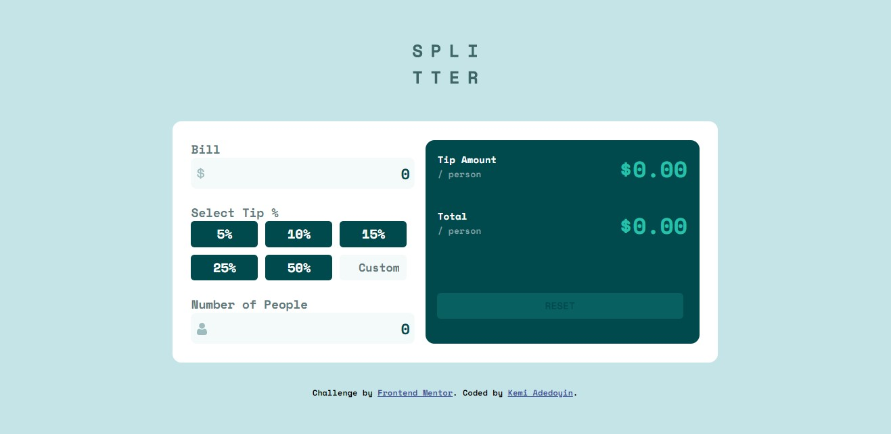
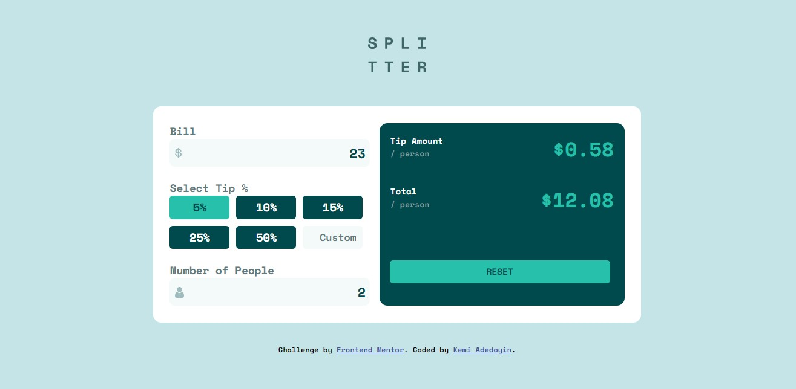
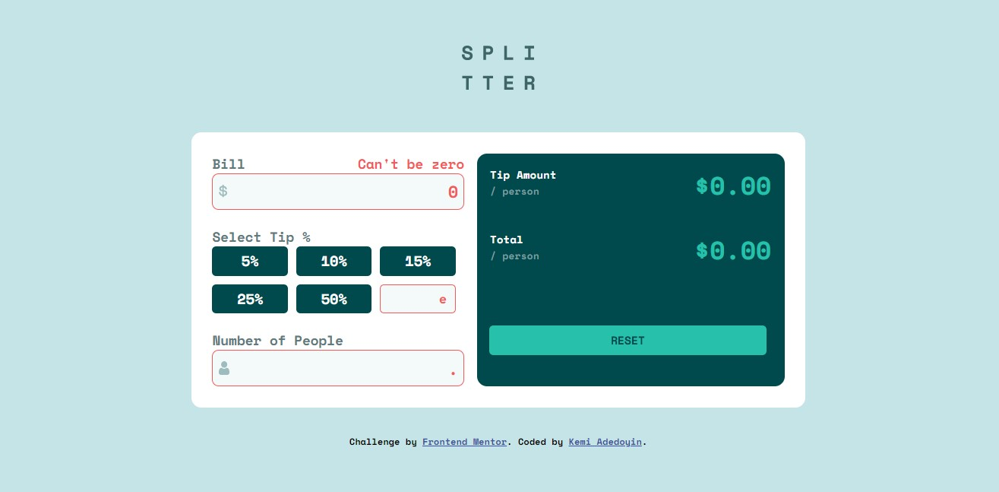

# Frontend Mentor - Tip calculator app solution

This is a solution to the [Tip calculator app challenge on Frontend Mentor](https://www.frontendmentor.io/challenges/tip-calculator-app-ugJNGbJUX). Frontend Mentor challenges help you improve your coding skills by building realistic projects.

## Table of contents

- [Overview](#overview)
  - [The challenge](#the-challenge)
  - [Screenshot](#screenshot)
  - [Links](#links)
- [My process](#my-process)
  - [Built with](#built-with)
  - [What I learned](#what-i-learned)
  - [Continued development](#continued-development)
- [Author](#author)

## Overview

### The challenge

Users should be able to:

- View the optimal layout for the app depending on their device's screen size
- See hover states for all interactive elements on the page
- Calculate the correct tip and total cost of the bill per person

### Screenshot
tip calculator ..

when active ..

input errors ..

### Links

- Solution URL: [Github](https://github.com/KemiDoyin/Tip-Calculator)
- Live Site URL: [https://billtip-calculator.netlify.app/](https://billtip-calculator.netlify.app/)

## My process

### Built with

- Semantic HTML5 markup
- CSS custom properties
- Flexbox
- CSS Grid

### What I learned

I learned a lot especially working with functions and event listener.

### Continued development

I would like to use frameworks like React to build ideas like this

## Author

- Website - [https://kemiadedoyin-ka.netlify.app/](https://kemiadedoyin-ka.netlify.app/)
- Frontend Mentor - [@KemiDoyin](https://www.frontendmentor.io/profile/KemiDoyin)
- Twitter - [@KemiAdedoyin_](https://twitter.com/KemiAdedoyin_)

